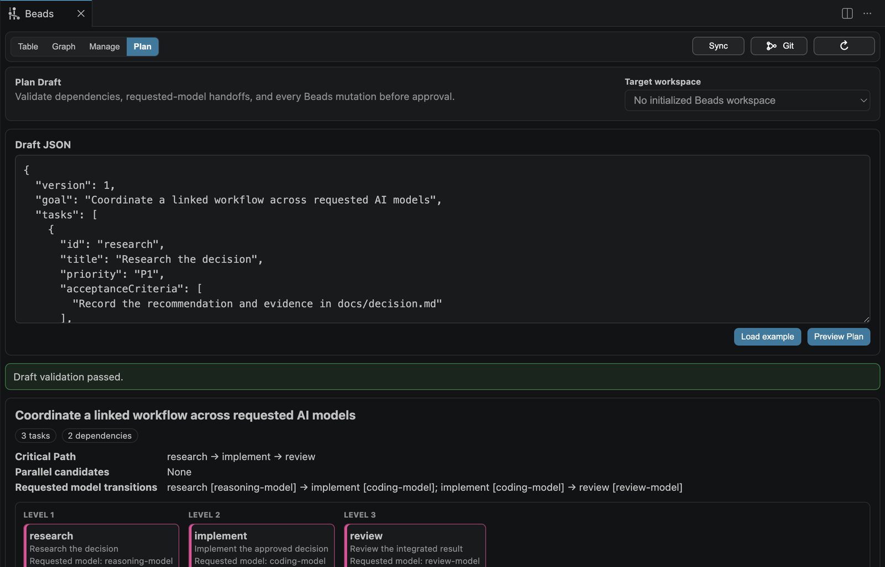

# Beads Git Graph

[](./LICENSE)
[](./CHANGELOG.md)

A local-first project manager for coordinating dependency-linked work across different AI providers
and requested models, with Git graph and Beads issue tools in one VS Code extension.

The extension itself emits no telemetry. Privacy-first. Security-first.



Describe a goal, generate dependency-linked tasks with a selected AI, and review every handoff
before approving an import or starting work.

## What It Does

- Shows branches, tags, merges, and uncommitted changes in a Git graph
- Fetches all configured remotes before a manual Graph refresh by default, shows the last successful
  fetch time, and labels `origin/*` as local remote-tracking refs rather than a live remote view
- Opens commit details, changed files, and diffs
- Adds a Beads view in the Activity Bar
- Lets you switch between Git Graph and Beads from the toolbar
- Lets you refresh, create, close, and sync Beads items inside VS Code
- Shows optional parallel, AI provider/model, audit artifact, SSOT/context, worktree, branch, PR, check, and sync-risk hints on Beads items
- Shows a Beads execution map that focuses a new viewport on Live, recorded in-progress, and
  `bd ready` work while preserving a saved viewport, with Critical Path, dependency arrows, dashed
  parent-child lines, merge/worktree risk, Start AI, Start Parallel, and merge actions
- Zooms the execution map around the location under the pointer, pans with normal drag, box-zooms
  with Option/Alt-drag, and preserves the transform when switching views, resizing, or refreshing
- Refreshes task data in place without moving the visible area while preserving the selected view,
  open details, filters, sorting, collapsed groups, scroll position, and graph transform
- Adds a Manage view that separates direct-provider Live work from Beads-recorded progress, review,
  queued work, and completed work
- Adds a Lite AI Plan Draft workflow that works before Beads is initialized, then validates and
  previews dependencies, Critical Path, parallel groups, requested provider/model transitions, and
  exact Beads mutations before import

## Use It

1. Open **Beads Git Graph: View Git Graph (git log)** from the Command Palette.
2. Open the Beads view from the Activity Bar.
3. Use the toolbar to refresh, sync, or switch views.

If your workspace has a `.beads` directory, the extension detects it automatically. It checks `bd`
on `PATH` and common Homebrew or Linuxbrew locations. Use **Locate bd…** or the machine-scoped
`beads-git-graph.bdPath` setting for another installation.

Without `.beads`, Plan remains available in Lite mode. **Initialize Beads** runs only after a modal
confirmation and only when `.beads` is absent. It uses this fixed command:
`bd init --non-interactive --skip-agents --skip-hooks --init-if-missing`. Depending on the installed
Beads version and repository state, `bd` may add and commit `.beads` metadata and `.gitignore`
changes. The extension never runs `bd migrate`, `bd bootstrap`, or a destructive reinitialization.

## Manage Agent Work

Open **Manage** in the Beads view to see the Agent Work Queue. It derives each lane from Beads status and recorded worktree, PR, check, and sync-risk metadata:

- **Needs attention**: explicitly blocked work, known failing checks, dangerous sync risk, or an unrecognized status
- **Live now**: this extension is awaiting direct-provider generation or verification for the task
- **Review**: a pull request is recorded and no supported failure signal is present
- **Recorded in progress**: Beads reports the task as in progress, without a live heartbeat
- **Queue**: open work, with confirmed readiness distinguished from readiness not yet confirmed by `bd ready`
- **Done**: Beads reports the task as closed

Live highlighting is limited to direct-provider generation and verification launched through this
extension. It stops before human review begins. GitHub Copilot does not expose completion telemetry
to this extension after the coding session opens, so Copilot and work launched outside the extension
are not shown as Live. “Recorded in progress” reflects Beads status only, and
unavailable evidence remains unconfirmed.

In Manage, **Start AI** is enabled only when `bd ready` confirms readiness. Use **Details**, **Start
AI**, and **Merge PRs** to continue through the existing workflow.

## Plan Agent Work

Open **Plan** in the Beads view and follow the explicit four-step flow:

1. Describe the project goal and select **Generate task plan with AI**.
2. Choose an Ollama, Hugging Face, OpenAI, or Anthropic direct-response provider and model, review
   the one-request confirmation, and approve it.
3. Review and edit the returned Plan Draft. The local preview shows tasks, dependencies, acceptance
   criteria, SSOT/provider/model hints, Critical Path, parallel groups, requested provider/model
   transitions, validation errors, and the exact ordered Beads mutations.
4. Select **Import Plan** only after the draft is correct, then move to **Manage** to run work that
   Beads currently reports as ready.

Lite Plan generation requires an open workspace folder but does not require `bd` or `.beads`.
AI generation creates an editable draft only. It does not import tasks, mutate Beads, execute the
response, initialize Beads, or start an agent. The planning request contains the goal, workspace
display name, available relative SSOT references, and configured provider/model choices; it does not include file
contents, an absolute workspace path, or credentials. The raw provider response is retained as a
local, plain-text, untrusted artifact for review. Do not put credentials or other secrets in the
goal or draft. GitHub Copilot is not used for draft generation because its integration opens a
coding session rather than returning a synchronous text response.

You can also open **Advanced: view or edit Plan Draft JSON** to paste a version 1 draft, load the
example, or edit the generated JSON directly. Preview remains local and read-only. When
dependency-linked tasks declare different providers or models, it shows the planned requested
provider/model transitions between them.

**Import Plan** is enabled only when the active workspace has a Beads database and the installed
`bd` executable demonstrates the required create, update, and dependency commands. The Extension
Host parses and validates the draft again, repeats the capability check, shows the mutation list,
and asks for explicit approval before executing it. Discarding the draft performs no Beads write.

A missing executable, unsupported command, or schema mismatch keeps import disabled and shows the
observed reason. Guided initialization is a separate confirmed action for a workspace with no
`.beads` directory. It never migrates, bootstraps, or replaces an existing database. If an approved
import fails partway through, it stops, reports created IDs plus failed and unexecuted operations,
and does not claim rollback.

## Multi-Agent Hints

The Beads view surfaces optional execution hints from issue fields, metadata, or labels:

- `parallelizable: true` or label `parallel-ok`
- `provider: "ollama"` or label `provider:ollama`
- `model: "gpt-5-codex"` or label `model:gpt-5-codex`
- `ssot: "AGENTS.md, .beads/issues.jsonl"` or label `ssot:AGENTS.md`
- `worktree: "../repo-agent-a"` or label `worktree:../repo-agent-a`
- `branch: "agent/task-a"` or label `branch:agent/task-a`
- `pr: 123`, `check_status: "success"`, or labels such as `pr:#123`, `checks:success`
- `sync_risk: "stale"` or label `sync-risk:stale`
- `output_path: "outputs/task-a.md"` (a relative `artifact` value is also accepted before the first run)

When you use **Start AI**, the extension asks for a provider and a provider-scoped model before
changing anything. Direct-provider editing requires observable acceptance criteria and exactly one
safe relative `output_path` (or a relative `artifact` value) on the Beads task.

| Provider               | Result                                                                                         |
| ---------------------- | ---------------------------------------------------------------------------------------------- |
| GitHub Copilot         | Creates or reuses an isolated worktree and opens a coding-agent session                        |
| Ollama                 | Locally reads/edits one declared artifact and can consume completed upstream artifact contents |
| Hugging Face Inference | Creates one declared new artifact from task metadata; existing workspace files are never sent  |
| OpenAI API             | Creates one declared new artifact with `store: false`; existing workspace files are never sent |
| Anthropic API (Claude) | Creates one declared new artifact from task metadata; existing workspace files are never sent  |

A direct-provider run uses a bounded generate-and-verify loop. Empty output and common refusal or
access-disclaimer responses are rejected before verification. A separate verifier request to the
selected provider/model checks the candidate against the task acceptance criteria and must return
structured evidence; one corrected generation is allowed. The exact normalized candidate is then
opened for human review. It is written only after **Apply Reviewed Edit** is selected. The task
remains `in_progress`, with `provider_status=edit_applied`, `acceptance_status=agent_passed`, and
`review_status=human_approved`; applying the edit is not the same as closing the task.

The edit host never executes model-generated shell commands. It can replace only the declared
relative target. Workspace escape, symlinks, `.git`, `.beads`, `.vscode`, `.codex`, `.agents`,
`.github`, environment files, any `AGENTS.md`, output above 256 KiB, and copied or near-copied
upstream artifacts are rejected. A local audit artifact shows the exact proposed file content while
keeping raw provider output and verification provenance separate.

Ollama requests stay on the configured loopback endpoint. They may include the current target file
and completed upstream artifacts so a dependent local agent can perform a real handoff. Cloud
providers receive task fields and their own generated candidate during verification, but no existing
workspace file content. They cannot replace an existing file or run a dependency-linked task. Use
local Ollama or a Copilot worktree for those cases.

Canceling a picker or the initial run confirmation performs no provider call, Beads write, or
workspace mutation. Rejecting the later per-task review preserves the audit artifact but applies no
file and performs no Beads write. The initial confirmation shows declared edit targets, maximum
request count, concurrency, and the local versus cloud data boundary. One task can make at most two
generation and two verification calls, so cloud providers may charge for up to four calls per task.

Before contacting a provider, the extension runs a non-mutating Beads capability check and reloads
the current task, dependencies, acceptance criteria, and declared target from `bd show`. Readiness
and dependencies are rechecked after generation and before the serialized workspace/Beads
mutation. If Beads update fails, a newly applied file is rolled back; the local audit artifact is
preserved for review.

Use **Beads Git Graph: Manage AI Provider Credentials** to store or delete Hugging Face, OpenAI, and
Anthropic credentials in VS Code SecretStorage. `HF_TOKEN`, `OPENAI_API_KEY`, and
`ANTHROPIC_API_KEY` are supported as environment fallbacks. API keys are not accepted in workspace
settings. Cloud endpoints are fixed, Ollama is restricted to loopback URLs, and all AI execution and
credential management require a trusted workspace.

Configure provider/model choices and the direct-provider concurrency and audit retention with:

- `beads-git-graph.agentModelOptions` for Copilot
- `beads-git-graph.agentOllamaModelOptions`
- `beads-git-graph.agentHuggingFaceModelOptions`
- `beads-git-graph.agentOpenAIModelOptions`
- `beads-git-graph.agentAnthropicModelOptions`
- `beads-git-graph.agentParallelConcurrency` for concurrent direct-provider tasks (default `4`,
  range `1`–`8`)
- `beads-git-graph.agentArtifactRetentionCount` for the maximum number of plain-text generation and
  verification audit artifacts kept in this workspace's VS Code extension storage (default `50`,
  range `1`–`500`)

Exact model availability remains provider/account-specific, so every picker also accepts a custom
model ID. On an 8 GB Apple Silicon machine, a practical starting point is the nominal 0.5B
`qwen2.5-coder:0.5b` model rather than an 8B model:

```sh
ollama pull qwen2.5-coder:0.5b
```

Then add `qwen2.5-coder:0.5b` to `beads-git-graph.agentOllamaModelOptions`. Small models need narrowly
decomposed tasks with literal, observable acceptance criteria. A refusal, generic answer, malformed
verdict, or failed acceptance check leaves the workspace unchanged and preserves the audit artifact.
The opt-in live smoke test uses the production generation, verification, upstream-handoff, and
file-application core for two dependency-linked artifacts. It does not drive the VS Code review
notification:

```sh
BEADS_AGENT_LIVE_OLLAMA_MODEL=qwen2.5-coder:0.5b pnpm exec vitest run tests/agentWorkspaceEdit.live.test.ts
```

A Hugging Face repository model run by Ollama should be represented as `provider=ollama` plus its
exact `hf.co/...` model name. Hugging Face Inference Providers may route through another inference
provider, so the extension does not infer an unconfirmed backend.

Use task dependencies to plan work across different requested AI models. Beads readiness controls
when dependent work becomes eligible. For local Ollama tasks, completed upstream `output_path`
contents become bounded read-only handoff context. The downstream agent still writes only its own
declared target. Copilot keeps the isolated worktree/session path. Cloud direct providers do not
receive upstream workspace artifacts.

When multiple ready tasks can run in parallel, **Start Parallel** asks whether to preserve each
task's provider/model handoff or override every selected task. It validates every task before
contacting providers and keeps one batch to at most 20 direct-provider tasks. Generation and
verification waits may overlap. Human review prompts, final readiness checks, file writes, Beads
updates, and Git/worktree mutations remain serialized per workspace.

The batch result distinguishes **Edit applied**, session started, prompt prepared, failed, skipped,
and cancelled. A failed verifier leaves the workspace unchanged and preserves its candidate audit
artifact. Successful direct tasks are not rerun when another task fails.

These hints are visual metadata. Beads ready/blocking behavior still comes from issue status and dependencies.

## Security and Privacy Boundaries

In VS Code Restricted Mode, the extension keeps Git history and tracked Beads JSON/JSONL viewing
available, but it does not start `bd`, contact an AI provider, manage provider credentials, create a
worktree, fetch a remote, or change Git or Beads state. Trust the workspace before using those actions. The
Extension Host enforces this boundary even if a webview sends a forged action message.

Every `bd` process started by this extension, including executable and capability checks, receives
`DOLT_DISABLE_EVENT_FLUSH=true`. This suppresses Dolt event flushing for those child processes. It
does not change the behavior of `bd` run manually outside the extension, and selected cloud AI
providers have their own network and privacy policies.

AI audit artifacts are unencrypted plain-text files in VS Code's workspace extension storage.
They are never executed as commands; verifier-approved content may be copied only to its declared
workspace target under the restrictions above. The oldest files are removed after the configured retention
count is exceeded, and **Beads Git Graph: Clear Stored AI Response Artifacts** deletes the retained
set after confirmation. Avoid sending or storing credentials, private keys, personal data, or other
secrets in prompts, generated responses, task titles, descriptions, notes, or labels.

Beads data is also local plain text and can be tracked by Git. This repository's default Beads setup
tracks selected JSONL/configuration records, so data committed to a public repository becomes
public. Review `.beads` and `.gitignore` changes before publishing. Confirmed guided initialization
may let `bd` create a Git commit. The extension does not silently initialize, never bootstraps or
migrates a database, and preserves schema-mismatch failures instead of bypassing them.

## SSOT Usage

The extension reads SSOT/context from `ssot-usage.json`, `.beads/ssot-usage.json`, or `.codex/ssot-usage.json` before falling back to built-in workspace defaults. The manifest can list default refs and richer context records:

```json
{
  "version": 1,
  "default": ["bd:${issueId}", "AGENTS.md", ".beads/issues.jsonl", "README.md"],
  "contexts": [
    {
      "id": "agent-rules",
      "path": "AGENTS.md",
      "use": "Repository-local instructions and workflow rules."
    }
  ]
}
```

Only existing local paths are added; refs such as `bd:${issueId}` and URLs are kept as-is.

For derived parallel merge tasks, **Merge PRs** checks the registered agent worktrees and branch PR checks before asking GitHub CLI to auto-merge their branch PRs. It blocks if a worktree is not registered, does not contain `origin/main`, has uncommitted changes, has no open PR, or has missing, pending, or failing checks.

You can run the same guard manually:

```bash
pnpm run worktree-sync:guard -- --base origin/main
```

The PR CI also runs the guard against the PR head so stale branches fail before merge.

## Docs

- [Contributing](./CONTRIBUTING.md)
- [Security Policy](./SECURITY.md)
