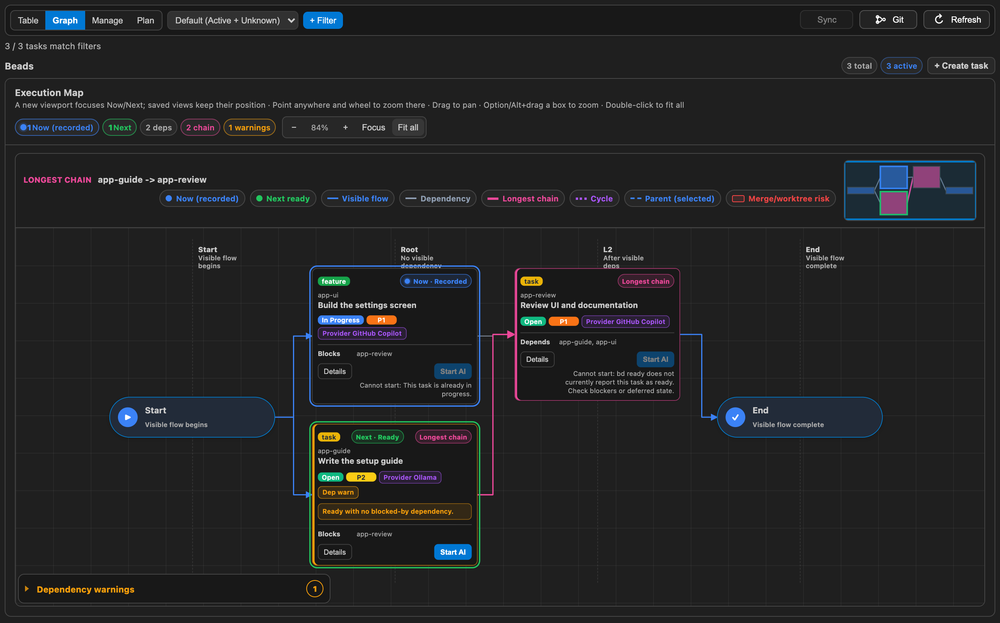
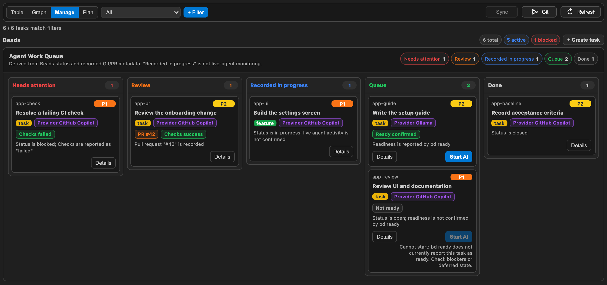

# Beads Git Graph

A local project workspace for coordinating tasks across AI providers in VS Code.
Plan work, follow dependencies, and review results alongside your Git history.

_Graph view with sample tasks. **Now** marks recorded work in progress; **Next** marks ready work._

## Find your way around

| View       | Use it to                                                               |
| ---------- | ----------------------------------------------------------------------- |
| **Graph**  | Follow dependencies, see Now/Next, and inspect the longest chain.       |
| **Table**  | Filter, sort, and inspect task details.                                 |
| **Manage** | Find blocked work, review recorded PRs, and start ready tasks.          |
| **Plan**   | Turn a goal into editable tasks and preview dependencies before import. |

_Manage view with sample tasks. Lanes reflect recorded Beads and Git/PR metadata, not live agent monitoring._

## Get started

1. Install from [VS Marketplace](https://marketplace.visualstudio.com/items?itemName=ToppyMicroServices.beads-git-graph)
   or [Open VSX](https://open-vsx.org/extension/ToppyMicroServices/beads-git-graph).
2. Open a Git repository. For task actions, use an existing Beads workspace with the `bd` CLI
   installed; the extension detects `.beads` automatically.
3. Open **Beads** from the Activity Bar. Use **Graph** to inspect work or **Plan** to draft tasks.

Git history works without Beads: run **Beads Git Graph: View Git Graph (git log)** from the Command
Palette. If `bd` is not on `PATH`, set `beads-git-graph.bdPath` in machine settings.
The extension does not initialize or migrate your Beads database.

**Graph controls:** wheel to zoom at the pointer, drag to pan, Option/Alt-drag to box-zoom,
and double-click to fit all. Your selection and viewport stay in place during normal refreshes.

## Choose how work runs

**Start AI** asks for a provider and model. It becomes available when Beads confirms the task is
ready and the workspace supports the required writes.

| Provider                            | Execution                                                                             |
| ----------------------------------- | ------------------------------------------------------------------------------------- |
| **GitHub Copilot**                  | Opens a coding-agent session in an isolated worktree.                                 |
| **Ollama**                          | Generates or edits one declared local artifact, including upstream artifact context.  |
| **Hugging Face, OpenAI, Anthropic** | Generates one new artifact from task metadata; existing workspace files are not sent. |

Direct-provider output is verified and shown for your approval before a file is written.
A generated response or applied edit does not automatically close a task.
See the [provider setup and execution guide](./docs/user-guide.md#multi-agent-hints) for credentials,
model choices, parallel runs, and limits.

For Copilot Agent mode, [install the separate Beads Agent Project Manager plugin](./docs/agent-plugin.md).

## Privacy and safety

Privacy-first, security-first: the extension emits no telemetry. AI execution requires a trusted
workspace and approval. Cloud providers have their own data policies. Task records and AI audit
files may contain plain text, and Beads files may be Git-tracked—keep secrets out of both.
Read the [security boundaries](./docs/user-guide.md#security-and-privacy-boundaries) before running agents.

## More

[User guide](./docs/user-guide.md) · [Testing](./docs/user-testing-agent-project-manager.md) ·
[Contributing](./CONTRIBUTING.md) · [Security policy](./SECURITY.md) · [Changelog](./CHANGELOG.md)
